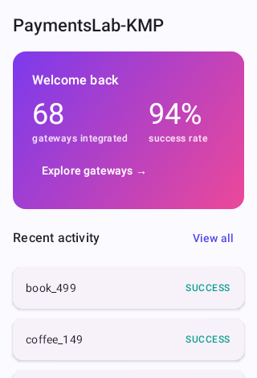
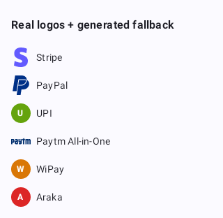

<div align="center">

# PaymentsLab

### An Integration Lab for the Android payments ecosystem — every gateway behind one abstraction, with a live look at what actually happens on each transaction.

[](https://github.com/darkpandawarrior/PaymentsLab/actions/workflows/ci.yml)


</div>

---

## Why PaymentsLab

Payments is the hardest integration surface on Android: every gateway ships a different SDK, most of
them are Activity-callback-era, the client can lie about the outcome, and the interesting logic
(signatures, webhooks, idempotency, recovery) lives on the server. That makes it a perfect subject
for a **systems** showcase rather than a UI one.

PaymentsLab runs — and **step-by-step visualizes** — real payment flows across multiple providers,
all behind a single `PaymentGateway` abstraction, backed by a small Ktor server that does the order
creation, signature verification and webhook reconciliation a real integration requires.

I built it to be three things at once:

1. **An architecture showcase** — a full Kotlin Multiplatform, multi-module design where each
   provider is an isolated, swappable Gradle module, the domain core is unit-tested against fakes,
   and the messy SDK reality is confined behind a coroutine-friendly host.
2. **A living catalog** — every provider the app touches is documented: what integrating it takes,
   whether a solo developer can demo it in sandbox, and the gotchas.
3. **A teaching reference** — the Lab renders each payment's lifecycle as a live timeline, showing
   the actual (redacted) payloads at every hop, so the *why* of payment architecture is visible.

## The one idea worth stealing

> **A client-side `Success` is a hint, never proof.** Only the server — after signature verification
> and webhook reconciliation — decides the true state.

Everything in the design flows from that: a server that owns price and truth, a client that always
confirms before trusting, a **journal written to Room *before* the SDK launches** so a process death
mid-payment is always recoverable, and a **redaction layer** so no secret or PII ever renders or logs.

## Highlights

- 🧩 **35-module KMP architecture, 66 gateways behind it.** One Gradle module per native-SDK
  provider, contributed into a registry via Koin `getAll<PaymentGateway>()` — adding gateway *N+1*
  touches no existing code. Feature modules never depend on each other; they meet only at the
  `:app` composition root. The catalog spans 7 native-SDK integrations, 47 hosted-webview gateways,
  8 mobile-money flows, and 4 catalog-only/KYC-gated entries — all behind the one contract below.
- 💸 **More than pay-in — five money-movement rails, plus split payments.** Beyond one-shot checkout
  the server now models **payouts** (`/payouts` — money *out* to a beneficiary), **mandates &
  subscriptions** (`/mandates` + scheduled debits and cancel), a **card vault** (`/vault` — tokenize
  once, charge later by id), **marketplace Connect onboarding** (`/connect` — sub-merchant KYC + split
  payouts), and an **internal double-entry wallet ledger** (`/wallet` — seed / debit / refund against a
  real running balance) — plus **split payments**, a two-leg orchestration that compensates if one leg
  fails. Ten new provider modules ride these rails — Paystack, Flutterwave, Paytm, Xendit, M-Pesa,
  Peach and NMI, plus a `wallet` balance rail and a `cash` record-only gateway — every one honest
  `MOCK_MODE` until real sandbox keys are set. Each rail is idempotency-keyed like the pay-in path.
- 🔌 **One contract, seven real SDKs — plus two generic archetypes.** Razorpay, Cashfree, Stripe
  (+ Google Pay), Square, Omise, and a raw UPI intent flow all implement the same tiny
  `PaymentGateway` interface. The Activity-callback SDKs are bridged into suspending coroutines by
  a `PaymentHost` that never leaks an `Activity` upward. `provider:hosted-webview` and
  `provider:mobile-money` cover the other 55 gateways generically — redirect-and-return-URL
  checkout and confirm-on-the-payer's-phone flows, respectively — behind the same contract.
- 🏠 **A real Home dashboard, not just a catalog.** Animated gateway-count and success-rate stats,
  recent activity, one tap into Explore — the redesign's front door, backed by the same
  server-authoritative payment journal every other screen reads.
- 🎨 **Real gateway branding, honestly degraded.** A `GatewayBranding` registry renders each
  provider's actual logo where a rights-cleared source exists (8 gateways today, sourced from
  `simple-icons`, CC0), and falls back to a deterministic, hash-colored monogram for the other 58 —
  every gateway gets an intentional-looking badge, and adding gateway *N+1* needs zero registry
  upkeep.
- 🔒 **Motion that reinforces security, not just decorates.** A brief `ShieldPulse` shield-icon
  draw-in on every payment-bearing screen visually reflects the `FLAG_SECURE` protection already in
  place underneath it — a half-second cue, not a gimmick, and it respects `LocalReducedMotion` like
  every other animated component in the app.
- 🪪 **Env-backed credentials that auto-degrade honestly.** `core:config` resolves each gateway's
  sandbox keys from `PLAB_<GATEWAY>_<MODE>_<KEY>` env vars; a gateway with no resolved credentials
  auto-degrades from `SANDBOX_READY` to `MOCK_MODE` instead of silently pretending to work — the Lab
  stays demoable and honest with zero real credentials configured.
- 🛡️ **Server is the source of truth.** A companion Ktor server creates orders (**price resolved
  server-side**), verifies payments with **real HMAC-SHA256** (Razorpay), and reconciles idempotent,
  signature-checked webhooks — the client callback is only ever treated as a hint.
- ⏱️ **Process-death recovery, for real.** Every in-flight payment is journaled to Room *before* the
  SDK opens; on cold start the orchestrator finds unresolved payments and reconciles them.
- 🔎 **Redaction by default.** A single choke point masks any secret/PII-shaped field before it can
  be rendered in the Lab timeline or written to a log.
- 🔐 **VAPT-grade security suite.** `core:security` — real Android Keystore AES-256-GCM at-rest
  encryption, `FLAG_SECURE` on payment screens (blocks screenshots/recording), device-integrity
  checks (root/Magisk, emulator, debugger), and a certificate-pinning config.
- ♻️ **Pure, replayable state machine.** The lifecycle is a pure `(State, Event) -> Effects` reducer
  (zero coroutines/DI/IO); the orchestrator just executes its effects. A payment's path is a
  recorded event log that replays byte-for-byte identically — the auditing property money movement
  wants.
- 🧪 **A real quality gate.** ktlint + detekt across all 35 modules (including KMP `commonMain`),
  fake-based unit tests for the orchestrator/ViewModels/backend, **20 deterministic Roborazzi
  screenshot tests** covering every redesigned screen, run on every push via GitHub Actions.

## Provider status matrix

The whole app is honest about what a solo developer can actually run without a business account.
This table highlights the native-SDK flagships and a few notable others — see the in-app catalog
(the Explore tab) for the full 66-gateway list, each with its own status badge and region.

| Provider | Category | Region | Sandbox (no KYC)? | In v1 | Notes |
|---|---|---|:--:|:--:|---|
| **Razorpay** | Gateway | India | ✅ | ✅ | Drop-in checkout; real HMAC-SHA256 signature verification |
| **Cashfree** | Gateway | India | ✅ | ✅ | Nextgen SDK; sandbox UPI simulator |
| **UPI intent** | Platform flow | India | ✅ | ✅ | Raw `upi://` intent, no SDK; client response is *unverifiable* by design |
| **Stripe** | Gateway | Global | ✅ | ✅ | PaymentSheet; 3DS2; Google Pay rides Stripe as the gateway |
| **Google Pay** | Method | Global | ✅ | ✅ | `ENVIRONMENT_TEST`, processed via Stripe |
| **Square** | Gateway | Global | ✅ | ✅ | In-App Payments SDK; real card-entry tokenization |
| **Omise** | Gateway | SE Asia | ✅ | ✅ | Manual tokenization; sandbox public/secret keypair |
| Paytm All-in-One | Gateway | India | ⚠️ | ✅ | Hosted-webview, `MOCK_MODE` — real MID needs business KYC |
| PhonePe PG | Gateway | India | ❌ | 📄 | MID needs business KYC — documented only |
| Juspay HyperSDK | Orchestrator | India | ❌ | 📄 | Credentials are B2B-issued — documented only |
| PayU | Gateway | India | ⚠️ | 📄 | Hosted-webview `MOCK_MODE`; shared test creds still a roadmap item |
| Play Billing | IAP | — | ⚠️ | 🔜 | Needs a Play Console listing — later milestone |

✅ runnable in sandbox · ⚠️ runs in `MOCK_MODE` (real integration code, no business KYC yet) ·
📄 catalog + docs only (gated) · 🔜 planned

## Screens & flows

Four screens behind one center action, not a flat list of tabs:

- **Home** — the front door. A gradient hero card with an animated gateway-count and success-rate
  stat (both server-derived, not hardcoded), a recent-activity preview pulled from the same Room
  journal every other screen reads, and one tap into Explore.
- **Explore** (the Integration Lab) — catalogs every provider with a status badge *and* its real
  logo or a deterministic monogram fallback. Tapping one opens a lab that executes the full
  lifecycle and renders it as a **live timeline**: order created → SDK launched → client result →
  server verification → settled, each step expandable to its actual redacted payload. This is the
  teaching surface — the sequence, and the fact that a client `Success` still has to pass through
  *Verifying* before it's trusted, is the whole point.
- **Checkout** — reached via the bottom bar's center "Pay" FAB, not a peer tab: a product checkout
  (cart → pay) that reuses the exact same provider registry and orchestrator, with an inline
  mini-timeline so the "normal" flow is explained as it runs.
- **Activity** (was History) — the transaction log, streamed from the Room journal, with status
  filter chips to narrow it down.

Every payment-bearing screen (Explore's provider lab, Checkout) opens with a brief `ShieldPulse`
shield-icon draw-in — visual reassurance that lines up with the real `FLAG_SECURE` protection
already active underneath it (screenshots/recording blocked). Motion elsewhere is deliberate, not
decorative: a shimmer on the `MOCK_MODE` badge, `SuccessBurst`/`FailureShake` terminal feedback, a
scramble-to-mask `RedactionReveal`, and an animated `PaymentFlowDiagram` that visualizes the
client-success-is-not-server-truth trust boundary as a moving packet. Every animated component
reads `LocalReducedMotion`, so system-level reduce-motion is honored everywhere, not bolted onto
one screen.

Home — the redesign's centerpiece — rendered as a deterministic Roborazzi screenshot:

<div align="center">

</div>

Real gateway logos where a rights-cleared source exists, a generated monogram everywhere else —
the same `GatewayBranding` registry Explore's provider cards use:

<div align="center">

</div>

> Screenshots are generated on the JVM (Robolectric, no emulator) and committed to
> [`docs/screenshots/`](docs/screenshots/) — see `ScreenshotCatalogTest`. Refresh with
> `./gradlew :app:recordRoborazziDebug`.

Explore → provider lab → settled, stitched from the same committed Roborazzi frames (no emulator
was used to record this — see [`docs/demo/`](docs/demo/) for how it's built):

<div align="center">

</div>

### Also runs on iOS

`ios/shared` packages the full 5-screen app — Home, Explore, provider lab, Checkout, Activity, the
same shared bottom-bar-plus-FAB chrome as Android — into a real `.framework`, consumed by a genuine
Xcode project at `ios/iosApp/`. Navigation is a plain `remember`-backed state machine instead of
Android's `NavController` (Navigation3 is Android-only), but the screen set is identical. The
screenshot below is a real iOS Simulator run of the same Compose UI, not a mockup:

<div align="center">

</div>

**Native-SDK gateways aren't Android-only either — most of them ship real iOS SDKs.** All five —
Stripe, Razorpay, Cashfree, Omise, and Square — are built as real native-SDK integrations on iOS,
the same pattern each time: a small Kotlin interface Kotlin/Native exports as a plain Objective-C
protocol, implemented in Swift against the vendor's real SDK (Kotlin/Native can't cinterop against
a Swift-only framework directly, so the direction has to run this way). Google Pay has no iOS
equivalent at all — Apple Pay is a separate Apple product, not a Google Pay port.

| Gateway | iOS SDK | Docs |
|---|---|---|
| Stripe | `StripePaymentSheet` (SPM, `26.1.0`) | [stripe-ios.md](docs/providers/stripe-ios.md) |
| Razorpay | `RazorpayCheckout` (SPM, `razorpay-pod` `1.5.4`) | [razorpay-ios.md](docs/providers/razorpay-ios.md) |
| Cashfree | `CashfreePGUISDK` Drop Checkout (SPM, `core-ios-sdk`) | [cashfree-ios.md](docs/providers/cashfree-ios.md) |
| Omise | `OmiseSDK` manual tokenization (SPM, `5.6.3`) | [omise-ios.md](docs/providers/omise-ios.md) |
| Square | `SQIPCardEntryViewController` (CocoaPods, `1.6.7` — no SPM distribution exists) | [square-ios.md](docs/providers/square-ios.md) |

<div align="center">

</div>

Build it yourself — **Square's CocoaPods dependency means the workspace, not the bare project, is
now the entry point**:

```bash
cd ios/iosApp
pod install   # needs Ruby >=3.0 for CocoaPods; see docs/providers/square-ios.md if your system Ruby is older
xcodebuild -workspace iosApp.xcworkspace -scheme iosApp -sdk iphonesimulator build
```

The `EmbedKotlinFramework` build phase runs the Gradle framework build automatically; the first
`xcodebuild` also resolves the four SPM-based SDKs.

## Architecture

The heart of the design is a deliberately tiny, platform-agnostic contract, with all the messy
platform reality pushed to the edges.

```kotlin
interface PaymentGateway {
    val id: GatewayId
    val meta: GatewayMeta
    suspend fun prepare(created: CreatedOrder): PreparedPayment
    suspend fun pay(host: PaymentHost, prepared: PreparedPayment): PaymentResult
}
```

- **`PaymentHost`** is opaque in `commonMain` — it carries no platform types, so the contract stays
  multiplatform. On Android the concrete host owns the `ComponentActivity` + ActivityResult plumbing
  and bridges each SDK's callback back into the suspending `pay()` call. This indirection is what lets
  Compose-era, coroutine-based feature code drive Activity-callback-era gateway SDKs without leaking
  Activity references upward.
- **`PaymentOrchestrator`** (in `core:orchestration`) coordinates one payment across four
  collaborators — the registry, the backend (server truth), the gateway SDK (client hint) and the
  journal (crash insurance) — and emits a `Flow<PaymentStep>` the Lab renders as a timeline. Because
  every collaborator is an interface, the whole flow is exercised in `commonTest` with fakes: no
  Android, no network, no real SDK.
- **The backend** mirrors the same plugin shape: thin Ktor routes over per-provider `GatewayAdapter`s.

### Module map

```
app/                       Android composition root — Koin wiring, navigation, AndroidPaymentHost
backend/                   Ktor JVM server — orders, verify, webhooks, status (server = truth),
                           plus payout / mandate / vault / connect / wallet-ledger rails
core/
  payments-api/            The frozen contract: PaymentGateway, PaymentResult, PaymentHost,
                           PaymentBackend, PendingPaymentJournal, PaymentStep, Redactor   (KMP + jvm)
  config/                  Env-backed credential resolution (PLAB_* keys), MOCK_MODE auto-degrade  (KMP)
  protocol/                @Serializable wire DTOs shared with the backend's JVM target    (KMP + jvm)
  orchestration/           the effectful shell + fsm/ — a PURE (State,Event)->Effects reducer it
                           drives; the tested heart (journal-first, server-as-truth, replayable)
  network/                 Ktor client implementing PaymentBackend
  data/                    Room KMP journal (process-death recovery)
  designsystem/            Compose Multiplatform theme, tokens, StepTimeline, Motion Kit
                           (shimmer, terminal feedback, flow diagram, ShieldPulse), PayloadCard,
                           GatewayBranding (real logo / monogram fallback), AppShell (nav chrome)
  security/                Keystore AES-256-GCM store, FLAG_SECURE, device-integrity, pinning config
  common/                  UiText, KMP logging, initKoin()/platformModule() (iOS-ready DI entry point)
provider/
  razorpay/ cashfree/ upi-intent/ stripe/ googlepay/ square/ omise/  one module per native SDK
  hosted-webview/          generic archetype for SDK-less, redirect-and-return-URL gateways (47)
  mobile-money/            generic archetype for confirm-on-payer's-phone flows (8)
  paystack/ flutterwave/ paytm/ xendit/ mpesa/ peach/ nmi/          dedicated modules (MOCK_MODE)
  wallet/                  internal double-entry ledger rail — pay from a stored balance
  cash/                    record-only "mark paid in cash" gateway (no SDK, no network)
  stripe-connect/          marketplace sub-merchant onboarding + split payouts
feature/
  home/                    dashboard — animated stats, recent activity (the app's front door)
  lab/                     provider catalog (Explore) + live per-provider lab timeline
  checkout-demo/           product checkout, reached via the bottom bar's center FAB
  history/                 transaction log from the Room journal (Activity), with status filters
app/ .../work/             PaymentReconciliationWorker — WorkManager process-death reconciliation
build-logic/               convention plugins (kmp.library / kmp.compose / cmp.feature / …)
```

### Data flow (one payment)

1. UI → `PaymentOrchestrator.pay(host, gatewayId, catalogItemId)`.
2. Orchestrator → backend `POST /orders`. **Journal-first:** a pending row is written to Room
   *before* the SDK launches — the process-death insurance.
3. `gateway.prepare()` → `gateway.pay(host, …)` → the SDK UI / UPI chooser.
4. The callback is mapped to a `PaymentResult`. **The client result is a hint, never truth.**
5. Orchestrator → backend `verify` (signature check) and/or polls `GET /payments/{id}` with backoff.
   Server state — updated by webhooks — is the single source of truth.
6. Terminal state → journal row resolved → history; the Lab timeline renders every step + payload.

### Payment rails (beyond one-shot pay-in)

A real platform moves money in more than one direction. Each rail below is a thin, idempotent Ktor
route set over an in-memory store, mirroring the pay-in path's journal-first, server-as-truth
discipline — and every one is `MOCK_MODE`-honest until real keys are configured.

| Rail | Routes | What it models |
|---|---|---|
| **Payouts** | `POST /payouts`, `GET /payouts/{id}`, mock `settle` | Money *out* to a beneficiary — Paystack Transfers rides it |
| **Mandates / subscriptions** | `POST /mandates`, `…/debits`, `…/cancel` | Recurring authorization + scheduled debits (Razorpay-shaped) |
| **Card vault** | `POST /vault/{customer}/instruments`, `…/charge` | Tokenize an instrument once, charge later by id (Stripe / Peach / NMI) |
| **Connect** | `POST /connect/onboard`, `…/{account}/payouts` | Marketplace sub-merchant KYC onboarding + split payouts (Stripe Connect) |
| **Wallet ledger** | `POST /wallet/{acct}/{seed,debit,refund}`, `GET …/balance` | Internal double-entry balance — the `wallet` provider pays from it |
| **Split payments** | order with split legs | Two-leg orchestration that compensates if one leg fails |

## Tech stack

| Layer | Technology |
|---|---|
| Language | Kotlin **2.4.0** (K2) |
| UI | Compose Multiplatform **1.11.1**, Material 3 |
| Build | AGP **9.2.1**, Gradle Kotlin DSL, convention plugins, version catalog |
| DI | Koin **4.2.2** (multiplatform) |
| Client networking | Ktor **3.5.1** client (OkHttp + Darwin engines) + kotlinx-serialization |
| Backend | Ktor **3.5.1** server (Netty), in-memory store (swappable for Exposed/SQLite) |
| Database | Room **2.8.4** (KMP, bundled SQLite) — the pending-payment journal |
| Concurrency | Coroutines + Flow (no LiveData); `kotlinx-datetime`, immutable collections |
| Provider SDKs | Razorpay Checkout, Cashfree PG (api + ui), Stripe PaymentSheet, Play Services Wallet |
| Security | Android Keystore (AES-256-GCM), FLAG_SECURE, device-integrity, OkHttp CertificatePinner |
| Background | WorkManager (payment reconciliation), Koin-backed WorkerFactory |
| Testing | JUnit, MockK, Turbine, kotlinx-coroutines-test, Koin-Test, **Roborazzi** screenshots; fake-first |
| Quality | detekt **1.23.8**, ktlint, **dependency-guard**, **Kover** coverage floor, Compose stability config |
| Shrinking | **R8** full-mode (release minify + resource shrink; APK 42M→13M), payment-SDK keep rules, mapping.txt |
| Observability | `CrashReporter` abstraction (Napier default; Crashlytics/Sentry = one-line DI swap) |
| Variants | `debug` / `release` / **`vapt`** (flips security bypass flags); per-env `BACKEND_URL` |
| Release | Fastlane (versioning + build lanes), `release.yml` (tag → GitHub Release + R8 mapping) |
| Targets | Android (compileSdk **37**, minSdk **24**) + iOS-ready KMP core; **JDK 21** |

## Getting started

> **JDK 21 is required.** detekt 1.23.x can't run on JDK 23+, so the whole build is pinned to 21.
> If your default `java` is newer, install one (`brew install openjdk@21`) and either point
> `org.gradle.java.home` in `gradle.properties` at it (as committed) or run with
> `JAVA_HOME=$(…/jdk-21) ./gradlew`.

```bash
git clone https://github.com/darkpandawarrior/PaymentsLab.git
cd PaymentsLab

# 1. Start the backend (in-memory store; sandbox/test adapters) — serves on :8080
./gradlew :backend:run

# 2. Build & install the app (points at 10.0.2.2:8080 from the emulator)
./gradlew :app:installDebug
```

Sandbox credentials are read from environment variables (see `backend/.env.example`); the app only
ever ships publishable keys, never secrets. Real end-to-end payment execution needs a device plus
each provider's sandbox keys — the SDK integrations compile and the flows are fully wired regardless.

Every gateway below the original three (Razorpay/Stripe/Cashfree) follows one convention —
`PLAB_<GATEWAY>_<MODE>_<KEY>` — resolved by `core:config`'s `EnvCredentialStore`. Unset → the
gateway auto-degrades to `MOCK_MODE`; set → it upgrades to real, no code change either way.
`backend/.env.example` predates the Tier-1 real-SDK batch, so the current full set is:

| Gateway | Vars | Self-serve sandbox? |
|---|---|---|
| Paystack | `PLAB_PAYSTACK_TEST_SECRET_KEY` | Yes — paystack.com |
| PayPal | `PLAB_PAYPAL_TEST_CLIENT_ID`, `_CLIENT_SECRET` | Yes — developer.paypal.com |
| Square | `PLAB_SQUARE_TEST_APPLICATION_ID`, `_ACCESS_TOKEN`, `_LOCATION_ID` | Yes — developer.squareup.com/apps |
| Omise | `PLAB_OMISE_TEST_PUBLIC_KEY`, `_SECRET_KEY` | Yes — dashboard.omise.co/signup |

<details>
<summary><b>All build &amp; tooling commands</b></summary>

```bash
# The full local + CI gate: ktlint + detekt (all modules) + every unit test
./gradlew fastGate

# Build the debug APK
./gradlew :app:assembleDebug

# Individual test suites
./gradlew :backend:test                          # Ktor testApplication (real HMAC, webhook idempotency)
./gradlew :core:orchestration:testAndroidHostTest # the tested heart, against fakes
./gradlew :provider:razorpay:testDebugUnitTest    # SDK-callback → PaymentResult mapping

# Static analysis only
./gradlew ktlintCheck detekt
```

</details>

## Testing & quality

- **The tested heart.** `PaymentOrchestrator` is covered end-to-end in `commonTest` with fakes —
  happy path timeline, journal-before-launch ordering, server-overrides-client-success, pending→poll,
  cancellation, and cold-start recovery. No Android, no network, no real SDK.
- **Fakes, not mocks.** ViewModels and the orchestrator are tested against fake repositories/gateways
  that implement the real interfaces; mocks are reserved for external services.
- **Backend.** Ktor `testApplication` asserts server-authoritative pricing, a **real** Razorpay
  HMAC-SHA256 pass/fail, idempotent webhook dedup, and 400s on unknown item/gateway.
- **Static analysis.** ktlint and detekt run across every module — detekt is pointed at the KMP
  `commonMain`/`androidMain` source sets, not just `src/main`, so the core and features are actually
  analyzed.
- **CI.** `.github/workflows/ci.yml` provisions JDK 21 and runs `fastGate` + `:app:assembleDebug` on
  every push and PR.
- **Distribution.** `release.yml` tags a build and publishes an unsigned APK to GitHub Releases
  (which also makes the app trackable via [Obtainium](https://github.com/ImranR98/Obtainium) — no
  separate config needed, it just needs a tagged release with an APK asset). `play-deploy.yml`
  (internal/beta/production), `fdroid-deploy.yml` (reproducible `-Pfdroid` build), `indus-deploy.yml`
  (PhonePe Indus Appstore), `amazon-appstore-deploy.yml`, `huawei-appgallery-deploy.yml`,
  `samsung-galaxy-store-deploy.yml`, and `aptoide-deploy.yml` are all real pipelines gated on repo
  secrets — see `keystore.properties.template` and each workflow's header comment for what to
  configure. All are no-ops until secrets are set. **Uptodown** has no public submission API — it's
  a manual web-form upload (in the future, point it at the GitHub Release APK).

## Security posture

- Secret keys live only in backend environment variables; the APK ships publishable keys only.
  `backend/.env.example` documents every credential; nothing sensitive is hardcoded.
- Client success callbacks are never trusted — the server verifies, and webhooks reconcile.
- Webhook signatures are verified before processing, and handlers are idempotent (event-id dedup).
- Idempotency keys on order creation; the app retries the *status check*, never the charge.
- The `Redactor` allowlist masks any secret/PII-shaped field before it is rendered or logged.
- **At-rest:** `core:security` stores saved tokens with Android Keystore AES-256-GCM (non-exportable
  key, TEE/StrongBox-backed). **On-screen:** payment routes are `FLAG_SECURE`. **Device:** launch-time
  root/emulator/debugger inspection. **Transport:** a certificate-pinning config (placeholder pins
  here — the localhost backend is intentionally unpinned; the pattern is real).

## Roadmap

- Braintree (headless v5) · PayU with real shared test creds (the gateway is already wired in
  `MOCK_MODE` — this is about upgrading it, not building it)
- Refunds (full/partial) and real RBI network tokens — the saved-card **vault rail** ships in
  `MOCK_MODE` today (Stripe / Peach / NMI); this is the real-token upgrade
- Real e-mandate & Stripe Billing execution — the **mandate/subscription rail** ships in `MOCK_MODE`
  today (create / debit / cancel); this is wiring the real recurring debits
- Google Play Billing v8 (needs a Play Console listing)
- Extract & publish `core:payments-api` as a standalone KMP library
- Expand `GatewayBranding`'s curated real-logo tier beyond the current 8 (the other 58 gateways
  render a generated monogram today — accurate, not broken, but a growing real-logo set would be
  nice)

## iOS readiness

The core is Kotlin Multiplatform, and iOS isn't a roadmap item anymore — it's a real, working app.
`ios/shared` packages the KMP-safe core plus all 5 native-SDK gateways with real Swift-side SDK
implementations (Stripe, Razorpay, Cashfree, Omise, Square) into a `.framework`, consumed by a
genuine Xcode project at `ios/iosApp/` with its own 5-screen navigation shell mirroring Android's.
See [Also runs on iOS](#also-runs-on-ios) above for the details and a real Simulator screenshot.

---

<div align="center">
<sub>Built as a portfolio flagship — a systems-level look at Android payments, not just a checkout screen.</sub>
</div>
